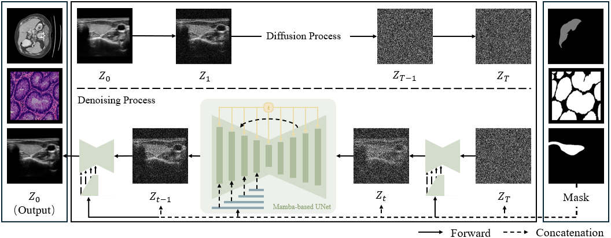

<div align="center">
<h1>MedMaskDiff</h1>
<h3>Mamba-based Medical Semantic Image Synthesis for Segmentation</h3>
  
Jiacheng Han, *Ke Niu*, Jiuyun Cai

🔥 News: This paper has been accepted as oral presentation by *ICIC'25* (CCF-C) !
</div>

## Abstract

To protect patient privacy, the ability of diffusion models to generate medi-cal images from noise has become a key focus for enriching datasets. How-ever, due to the high precision required for medical image anatomical struc-tures, generative models designed for natural scenes fail to meet the strin-gent standards for medical logic. We propose MedMaskDiff, a Mamba-based semantic image synthesis model that generates medical images from masks, which takes full advantage of Mamba's capability to capture long-range med-ical features. Additionally, it utilizes an evolutionary condition-guide meth-od to enhance the quality and medical logic of the generated target regions. MedMaskDiff outperforms other advanced methods in synthesizing liver CT, thyroid nodule ultrasound, and low-grade intraepithelial neoplasia microsco-py images. By utilizing masks from other liver CT datasets for semantic syn-thesis and data augmentation, comparative experiments demonstrate that MedMaskDiff effectively safeguards patient privacy while enhancing down-stream medical image segmentation tasks, significantly improving the per-formance of segmentation models.

## Overview

* The overall architecture of MedMaskDiff.

<p align="center">
  
</p>

## Getting Started

### **0. Main Environments** </br>
The environment installation procedure can be followed the steps below (python=3.10):</br>

```
conda create -n cfmunet python=3.10
conda activate cfmunet
pip install torch==2.1.1 torchvision==0.16.1 torchaudio==2.1.1 --index-url https://download.pytorch.org/whl/cu118
pip install packaging
pip install timm==0.4.12
pip install pytest chardet yacs termcolor
pip install submitit tensorboardX
pip install triton==2.0.0
pip install causal_conv1d
pip install mamba_ssm
pip install scikit-learn matplotlib thop h5py SimpleITK scikit-image medpy yacs
```
### **1. Datasets.** </br>
For CT images, we selected the classic liver dataset LiTS and randomly chose 1030 liver slices. For ultrasound images, we selected the thyroid nodule dataset TG3K and randomly chose 1500 thyroid ultrasound images. For cellular microscopy, we used all the low-grade intraepithelial neoplasia images from the EBHI-SEG dataset.
- [LiTS.zip](https://pan.baidu.com/s/13DVRwZTf00kilcrhppU-xA)
- [TG3K.zip](https://pan.baidu.com/s/1DqlqZtC1X0LiB9VHfx1OEQ)
- [EBHI-SEG.zip](https://pan.baidu.com/s/1goFgtYOMIrWf46K1X8Zsvw)

### **2. Train the KMC-UNet** </br>
You can try using the model in `MedMaskDiff.py`.

## Acknowledgement
Thanks to [VMamba](https://github.com/MzeroMiko/VMamba) for their outstanding work.
